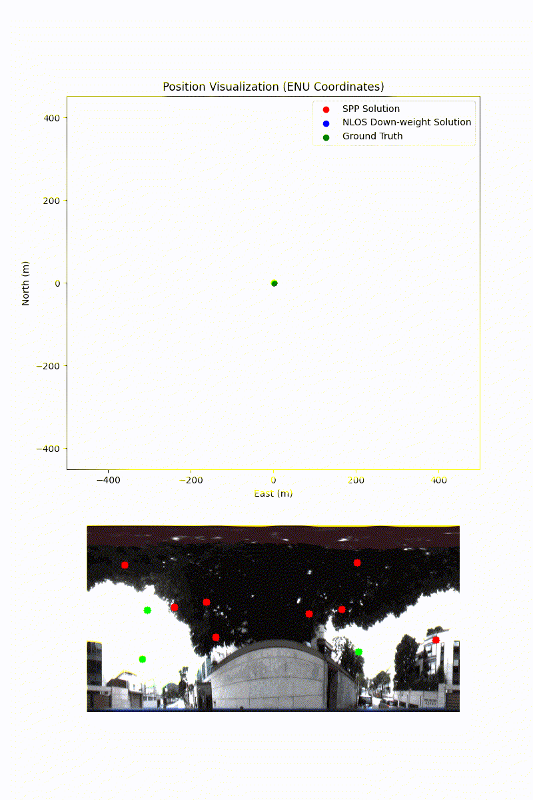
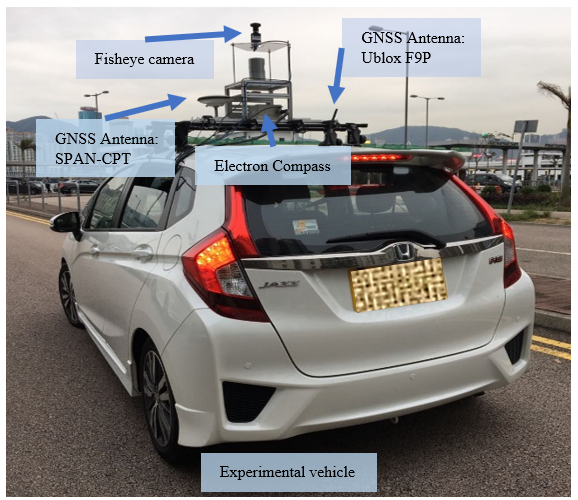
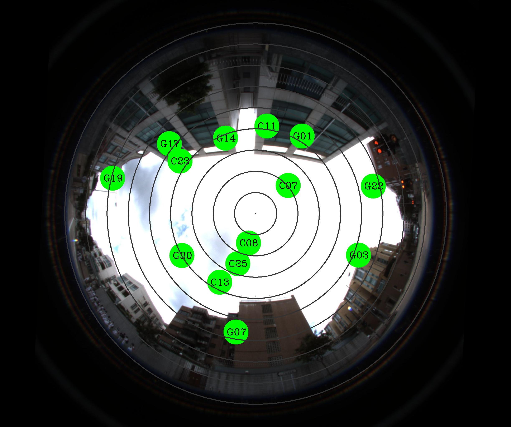
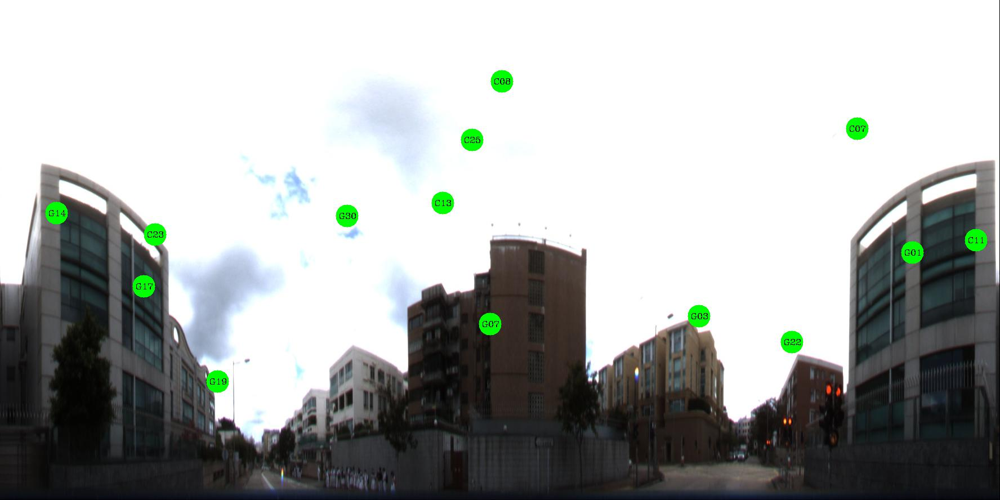

# KLT_Dataset

The KLT dataset is a light urban scenario dataset containing **GNSS raw measurements** collected using a U-blox F9P receiver, **ground truth** provided by the SPAN-CPT system, and **LOS/NLOS labels** for ***GPS*** and ***Beidou*** satellites. Additional data, such as IMU, LiDAR, and camera recordings, are also included in the ROS bag file.

We also provide a start script and configuration files to enable researchers to get started with the dataset quickly and efficiently.

## Quick Start

1. Clone the repository 
   ```bash
   git clone https://github.com/ebhrz/KLTDataSet
   ```
2. Install the dependencies
   ```bash
   cd KLT_Dataset
   pip install -r requirements.txt
   ```
3. Download the data from [Dropbox](https://www.dropbox.com/scl/fo/gz7olnsojd3qyjjjbzoso/AIb0qbtm4OSRYVgttH5l8y0?rlkey=2d2fext0lekvsp7t1g2qr97rq&st=1vphqymn&dl=0), and extract **data** and **label** to the repository folder. The folder tree should looks like:
   ```
   .
    ├── config
    │   ├── 0610_klt1_203.json
    │   ├── ...
    ├── data
    │   ├── GNSS
    │   └── ROS
    ├── label
    │   ├── 0610_KLT1_203
    │   ├── 0610_KLT2_209
    │   ├── 0610_KLT3_404
    │   ├── 1109_KLT1_421
    │   ├── 1109_KLT2_294
    │   ├── 1109_KLT2_301
    │   ├── 1109_KLT3_666
    │   ├── 1116_KLT1_184
    │   ├── 1116_KLT2_169
    │   └── 1116_KLT3_649
    ├── LICENSE
    ├── README.md
    ├── requirements.txt
    ├── rtk_util.py
    └── demo.py
   ```
   If you don't use the ROS data, you can only download the **label** and **data/GNSS** folder, because the bag file is huge.
4. Now, run the demostration.
   ```
   python demo.py config/0610_klt1_203.json
   ```
   You can see the figure.
   

Now start to explore the dataset via the demo python script! If you find our dataset useful, we would greatly appreciate it if you could cite our work:

```latex
@inproceedings{hu2023fisheye,
  title={Fisheye camera aided NLOS exclusion and learning-based pseudorange correction},
  author={Hu, Runzhi and Wen, Weisong and Hsu, Li-ta},
  booktitle={2023 IEEE 26th International Conference on Intelligent Transportation Systems (ITSC)},
  pages={6088--6095},
  year={2023},
  organization={IEEE}
}
```

## Introduction
Datasets are essential for training machine learning (ML) and deep learning (DL) models, especially when it comes to accurate labeling, which is critical for NLOS classification and pseudorange correction. Although several urban canyon datasets offer raw GNSS measurements and ground truth, only a limited number provide labeled NLOS data. This gap often forces researchers to rely on proprietary datasets, leading to a lack of standardized benchmarks. Widely recognized datasets such as KITTI[^1], ApolloScape[^2], Waymo[^3], and nuScenes[^4] omit raw GNSS data altogether. Our open-source datasets, UrbanLoco[^5] and UrbanNav[^6], do include raw GNSS measurements and positional ground truth but do not feature NLOS labels. Mytuc[^7] takes a step towards identifying NLOS satellites by comparing them to ground truth, yet this approach lacks sufficient precision. In previous work[^8], we used a 3D map to classify NLOS satellites, but pre-built maps don't account for real-time obstructions such as trees or vehicles.

In conclusion, the absence of a dataset that offers both raw GNSS measurements and accurate NLOS labels continues to hinder researchers seeking comprehensive benchmarks. To address this gap, we leveraged our proven equipment platform and data collection methods[^6] to develop the Kowloon Tong (KLT) dataset. This dataset accounts for temporal variations, satellite distribution, and differing lighting conditions. Through our automated labeling technique[^9], we achieve a high degree of accuracy (approximately 99%) in identifying NLOS satellites. A detailed comparison of this dataset with others is provided in the table below.


| Existing Dataset    | Environments | Raw GNSS Data | Ground Truth | IMU  | LiDAR | Fisheye Camera | NLOS Label |
|---------------------|--------------|---------------|--------------|------|-------|----------------|------------|
| KITTI[^1]           | Urban        | ❌            | ✅           | ✅   | ✅    | ❌             | ❌         |
| ApolloScape[^2]     | Urban        | ❌            | ✅           | ✅   | ✅    | ❌             | ❌         |
| Waymo[^3]           | Urban        | ❌            | ✅           | ✅   | ✅    | ❌             | ❌         |
| nuScenes[^4]        | Urban        | ❌            | ✅           | ✅   | ✅    | ❌             | ❌         |
| UrbanLoco[^5]       | Urban        | ✅            | ✅           | ✅   | ✅    | ❌             | ❌         |
| UrbanNav[^6]        | Urban        | ✅            | ✅           | ✅   | ✅    | ❌             | ❌         |
| Mytuc[^7]           | Urban        | ✅            | ✅           | ❌   | ❌    | ❌             | ✅         |
| KLT (Proposed)      | Urban        | ✅            | ✅           | ✅   | ✅    | ✅             | ✅         |


## Collection Platform

Below figure shows our platform. For more details, please refer to our [UrbanNav Dataset](https://github.com/IPNL-POLYU/UrbanNavDataset)



## Summary Of The Dataset
The below table shows the summary of the dataset. The dataset includes 10 subsets listed in the table, which vary in time, satellite distribution and illumination. Please noticed that we only labeled ***GPS*** and ***Beidou*** satellites.
| Dataset No. | Date       | Time         | Area | Illumination | Epoch | Samples | LOS/NLOS   |
|-------------|------------|--------------|------|--------------|-------|---------|------------|
| KLT1-203    | 2021.06.10 | 11:35-11:38  | KLT1 | High         | 203   | 3295    | 1862/1433  |
| KLT2-209    | 2021.06.10 | 11:48-11:51  | KLT2 | High         | 209   | 3498    | 1738/1760  |
| KLT3-404    | 2021.06.10 | 11:52-11:58  | KLT3 | High         | 404   | 6309    | 3918/2391  |
| KLT2-301    | 2023.11.09 | 17:37-17:42  | KLT2 | High         | 301   | 4838    | 3154/1684  |
| KLT2-294    | 2023.11.09 | 17:43-17:48  | KLT2 | High         | 294   | 4992    | 3253/1739  |
| KLT1-421    | 2023.11.09 | 17:05-17:12  | KLT1 | High         | 421   | 6607    | 4197/2410  |
| KLT3-666    | 2023.11.09 | 17:12-17:23  | KLT3 | Medium       | 666   | 10085   | 6481/3604  |
| KLT2-169    | 2023.11.16 | 17:50-17:53  | KLT2 | Medium       | 169   | 2713    | 1710/1003  |
| KLT1-184    | 2023.11.16 | 17:53-17:56  | KLT1 | Low          | 184   | 2891    | 1877/1014  |
| KLT3-649    | 2023.11.16 | 17:56-18:07  | KLT3 | Very Low     | 649   | 9826    | /          |


## Data

For more information on how to use the dataset, you can refer to the **demo.py**.

#### GNSS Data

GNSS data is collected by U-blox F9P. The observation file is stored in **data/GNSS/\*/COM\*.obs**. Please notice that we collect data from four constellations including GPS, Beidou, Galileo and BLONASS, but only GPS and Beidou satellites are labeld.

#### Reference Station Data

We are sorry that we can not directly provide the reference station data due to the policy of Hong Kong Lands Department. You can download the reference station data from [here](https://www.geodetic.gov.hk/en/rinex/downv.aspx). We recommand you use the data from HKSC station.

#### Ground Truth

Ground truth is stored in **label/\*/gt.csv**. The first column is the timestamp(**in GPS time!!! convert to UTC lease add the leap seconds 18**), and the rest are the LLH coordinate.

#### Label Data

Label data is in **label/\*/nlos.pkl**. This file is generated by **python pickle**. You can use follow script to read the content:
```python
import pickle
import pyrtklib as prl

def satindex2name(sats):
    name = prl.Arr1Dchar(4)
    if not isinstance(sats,list):
        prl.satno2id(sats+1,name)
        return name.ptr
    names = []
    for i in sats:
        prl.satno2id(i+1,name)
        names.append(name.ptr)
    return names

with open("label/0610_KLT2_209/nlos.pkl",'rb') as f: # KLT1_203 for example
   labels = pickle.load(f)

for label in labels:
   print("the timestamp: ", label[0]) # timestamp
   print("all the satellite index: ", label[1]) # start from 0, please +1 to get the actual id
   print("all the satellite name: ", satindex2name(label[1]))
   print("LOS satellite index: ", label[2]) # the LOS satellites index
   print("LOS satellite name: ", satindex2name(label[2]))
   print("the corresponding flatten fisheye image shape: ", label[3].shape)
   for satid in label[4]:
      part = label[4][satid]
      print(f"satellite {satid}: the part image shape of the satellite projection on the flatten fisheye image: ", part[0].shape)
      print(f"satellite {satid}: the coordinate of satellite the projection on the flatten fisheye image ({part[1]/3.46875},{part[2]/3.46875})")
```

#### Image Data

Also in the **label folder**, there is "**image.zip**" file. There are three kinds of images in the zip file, including ***original fisheye image with satellite projection***,  ***flatten fisheye image with satellite projection***, and the ***sky segmentation of the flatten fisheye image***.
There are examples below:




#### ROS Bag
For data in 2021/06/10, the camera topics are **/zed2/camera/left/image_raw** and **/zed2/camera/right/image_raw**. For data in 2023/11/09 and 2023/11/16, the camera topic is **/pointgrey/left_camera/image_color/compressed**. For all the bag files, the fisheye camera topic is **/fisheye/image_color/compressed**, the Velodyne 32 HDL topic is **/velodyne_points**. Two 16-scan LiDARs' topic are **/left/lslidar_point_cloud** and **/right/velodyne_points**. The IMU data is at **/imu/data**. For the extrinsic parameters, please refer to [UrbanNav Dataset](https://github.com/IPNL-POLYU/UrbanNavDataset)

## Trajectory
#### KLT1-203
<image  src = "image/path/0610_KLT1_203.gif"></image>

#### KLT2-209
<image  src = "image/path/0610_KLT2_209.gif"></image>

#### KLT3-404
<image  src = "image/path/0610_KLT3_404.gif"></image>

#### KLT1-421
<image  src = "image/path/1109_KLT1_421.gif"></image>

#### KLT2-294
<image  src = "image/path/1109_KLT2_294.gif"></image>

#### KLT2-301
<image  src = "image/path/1109_KLT2_301.gif"></image>

#### KLT3-666
<image  src = "image/path/1109_KLT3_666.gif"></image>

#### KLT1-184
<image  src = "image/path/1116_KLT1_184.gif"></image>

#### KLT2-169
<image  src = "image/path/1116_KLT2_169.gif"></image>

#### KLT3-649
<image  src = "image/path/1116_KLT3_649.gif"></image>
## Reference
[^1]: A. Geiger, P. Lenz, and R. Urtasun, “Are we ready for autonomous driving? The KITTI vision benchmark suite,” in *2012 IEEE Conference on Computer Vision and Pattern Recognition*, IEEE, 2012, pp. 3354–3361.
[^2]: X. Huang, X. Cheng, Q. Geng, B. Cao, D. Zhou, P. Wang, Y. Lin, and R. Yang, “The ApolloScape dataset for autonomous driving,” in *Proceedings of the IEEE Conference on Computer Vision and Pattern Recognition Workshops*, 2018, pp. 954–960.
[^3]: P. Sun, H. Kretzschmar, X. Dotiwalla, A. Chouard, V. Patnaik, P. Tsui, J. Guo, Y. Zhou, Y. Chai, B. Caine et al., “Scalability in perception for autonomous driving: Waymo open dataset,” in *Proceedings of the IEEE/CVF Conference on Computer Vision and Pattern Recognition*, 2020, pp. 2446–2454.
[^4]: H. Caesar, V. Bankiti, A. H. Lang, S. Vora, V. E. Liong, Q. Xu, A. Krishnan, Y. Pan, G. Baldan, and O. Beijbom, “nuScenes: A multimodal dataset for autonomous driving,” in *Proceedings of the IEEE/CVF Conference on Computer Vision and Pattern Recognition*, 2020, pp. 11 621–11 631.
[^5]: W. Wen, Y. Zhou, G. Zhang, S. Fahandezh-Saadi, X. Bai, W. Zhan, M. Tomizuka, and L.-T. Hsu, “UrbanLoco: A full sensor suite dataset for mapping and localization in urban scenes,” in *2020 IEEE International Conference on Robotics and Automation (ICRA)*, IEEE, 2020, pp. 2310–2316.
[^6]: L.-T. Hsu, F. Huang, H.-F. Ng, G. Zhang, Y. Zhong, X. Bai, and W. Wen, “Hong Kong UrbanNav: An open-source multisensory dataset for benchmarking urban navigation algorithms,” *NAVIGATION: Journal of the Institute of Navigation*, vol. 70, no. 4, 2023.
[^7]: P. Reisdorf, T. Pfeifer, J. Breßler, S. Bauer, P. Weissig, S. Lange, G. Wanielik, and P. Protzel, “The problem of comparable GNSS results–An approach for a uniform dataset with low-cost and reference data,” in *Proc. of Intl. Conf. on Advances in Vehicular Systems, Technologies and Applications (VEHICULAR)*, 2016.
[^8]: G. Zhang, P. Xu, H. Xu, and L.-T. Hsu, "Prediction on the Urban GNSS Measurement Uncertainty Based on Deep Learning Networks with Long Short-Term Memory," in *IEEE Sensors Journal*, vol. 21, no. 18, IEEE, 2021, pp. 20563–20577.
[^9]: R. Hu, W. Wen, and L.-T. Hsu, “Fisheye camera aided GNSS NLOS detection and learning-based pseudorange bias correction for intelligent vehicles in urban canyons,” in *2023 IEEE 26th International Conference on Intelligent Transportation Systems (ITSC)*, IEEE, 2023, pp. 6088–6095.
